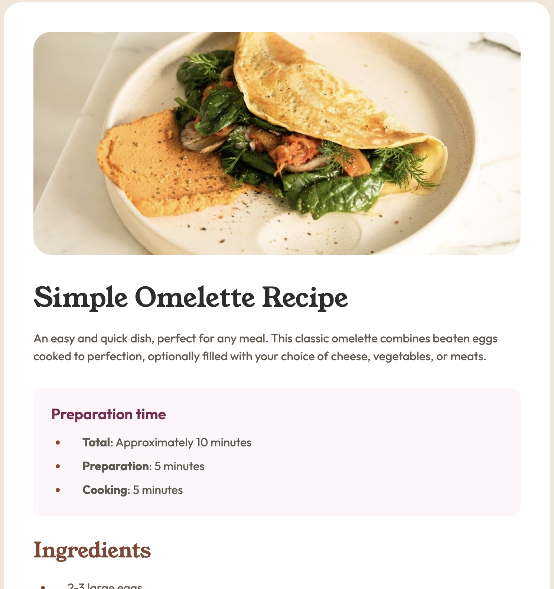

# Frontend Mentor - Recipe page solution

This is a solution to the [Recipe page challenge on Frontend Mentor](https://www.frontendmentor.io/challenges/recipe-page-KiTsR8QQKm). Frontend Mentor challenges help you improve your coding skills by building realistic projects.

## Table of contents

- [Overview](#overview)
  - [The challenge](#the-challenge)
  - [Screenshot](#screenshot)
  - [Links](#links)
- [My process](#my-process)
  - [Built with](#built-with)
  - [What I learned](#what-i-learned)
  - [Continued development](#continued-development)

## Overview

### Screenshot



### Links

- Solution URL: [Add solution URL here](https://your-solution-url.com)
- Live Site URL: [Add live site URL here](https://your-live-site-url.com)

## My process

### Built with

- Semantic HTML5 markup
- CSS custom properties
- Flexbox
- Mobile-first workflow
- Google Fonts API

### What I learned

During this project, I focused on improving my layout skills using Flexbox and practicing a mobile-first approach. One specific area of learning was the use of the ::marker pseudo-element to style list bullets and numbers, which allows for cleaner HTML without needing extra span tags.

I'm also proud of the table styling, specifically using border-collapse: collapse and targeting rows to create a clean, minimalist data presentation:

```html
<h1>Some HTML code I'm proud of</h1>
```

```css
table.nutrition-table {
  width: 100%;
  text-align: left;
  border-collapse: collapse;
}

tr:not(:last-child) {
  border-bottom: 1px solid var(--stone-150);
}
```

Additionally, I implemented a responsive container that adds padding and rounded corners on larger screens while maintaining a flush look on mobile:

```css
@media (min-width: 48rem) {
  main.container {
    width: 80.2083%;
    border-radius: 1.5rem;
    padding: 2.5rem;
    margin: 8rem auto;
  }
}
```

### Continued development

In future projects, I want to:

- **Refine Typography**: Improve my use of fluid typography (using clamp()) to make headings scale more smoothly between mobile and desktop.

- **Advanced Selectors**: Dive deeper into CSS selectors like :nth-of-type to handle complex list styling even more efficiently.

- **Accessibility**: Ensure that all custom-styled tables and lists remain fully accessible to screen readers.
