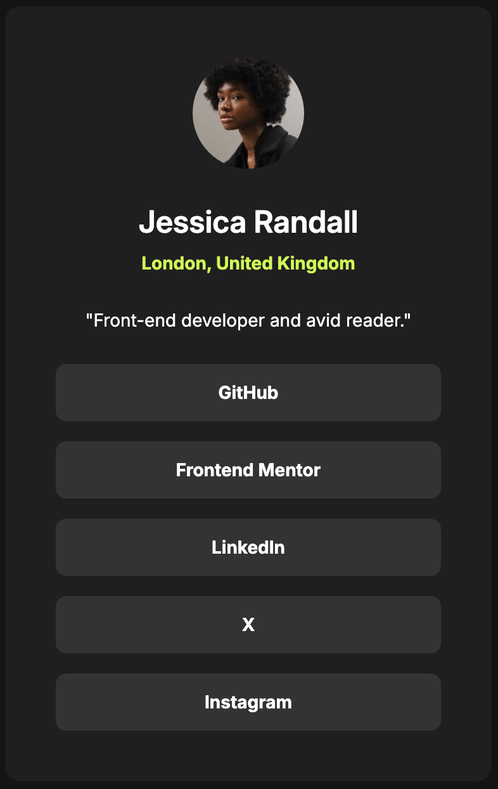

# Frontend Mentor - Social links profile solution

This is a solution to the [Social links profile challenge on Frontend Mentor](https://www.frontendmentor.io/challenges/social-links-profile-UG32l9m6dQ). Frontend Mentor challenges help you improve your coding skills by building realistic projects.

## Table of contents

- [Overview](#overview)
  - [The challenge](#the-challenge)
  - [Screenshot](#screenshot)
- [My process](#my-process)
  - [Built with](#built-with)
  - [What I learned](#what-i-learned)
- [Author](#author)

## Overview

### The challenge

Users should be able to:

- See hover and focus states for all interactive elements on the page

### Screenshot



## My process

### Built with

- Semantic HTML5 markup
- CSS custom properties
- Flexbox
- Mobile-first workflow

### What I learned

During this project, I focused on creating a clean, accessible layout using semantic HTML. I particularly enjoyed implementing the .sr-only class to ensure that screen reader users are informed when a link opens in a new tab, without cluttering the visual UI.

I also practiced using CSS variables for consistent theming and smooth transitions for the interactive hover states.

```html
<a
  href="https://github.com/"
  target="_blank"
  rel="noopener noreferrer"
  class="btn"
>
  GitHub <span class="sr-only">(opens in new tab)</span>
</a>
```

```css
nav ul li {
  background-color: var(--grey-700);
  border-radius: 0.5rem;
  padding: 0.75rem;
  text-align: center;
  transition: all 0.3s ease-in-out;
}

nav ul li:hover {
  background-color: var(--green);
}
```

### Continued development

In future projects, I want to dive deeper into:

Advanced CSS Grid: While I used Flexbox for most of this layout, I want to explore more complex Grid areas.

Accessibility (A11y): Further refining my use of ARIA attributes and ensuring keyboard navigation is seamless.
